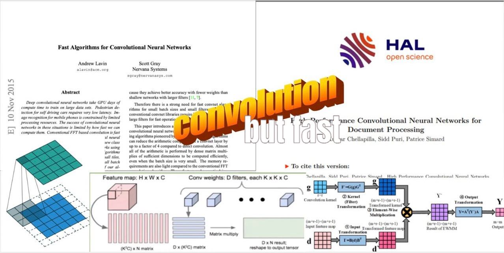

# Convolution but fast

Little repo following my blog post : [Convolution, but fast](https://tayheau.github.io/2024/10/16/convolution_but_fast.html)

This purely to ulistrate the implementation of some conv algorithms. You can use it for your own project ;D.

You can also play with it on some images to learn more about the convolution, to apply gaussian blur or extract edges for example.

