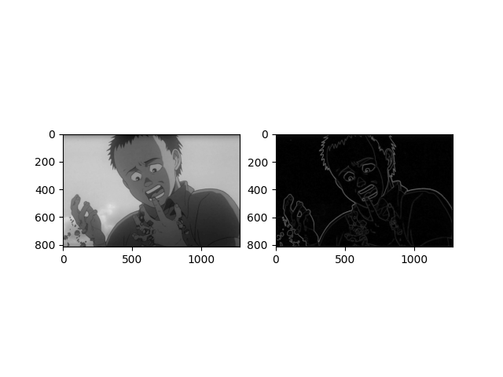

# Convolution but fast



Little repo following my blog post : [Convolution, but fast](https://tayheau.github.io/2024/10/16/convolution_but_fast.html)

This purely to ulistrate the implementation of some conv algorithms. You can use it for your own project ;D.

You can also play with it on some images to learn more about the convolution, to apply gaussian blur or extract edges for example.

## Quick Usage

### Install dependencies:
```bash
pip install numpy matplotlib pillow
```

### Run the script:
```bash
python convolve.py --image_file 'path/to/image.ext' --filter 'edges_extract'
```
- `--image_file`: Path to the image file.
- `--filter`: Choose from:
  - `edges_extract`
  - `gaussian`
  - `invert`

### Example: Apply a filter in code
```python
from convolution import memstrided_matrix_convolution_2d
from convolve import get_image_greyscale, show_images

img = get_image_greyscale('path/to/image.jpg')
kernel = np.array([[1, 0, -1], [1, 0, -1], [1, 0, -1]])  # Edge detection
result = memstrided_matrix_convolution_2d(img, kernel)
show_images([img, result], cmap='gray')
```
